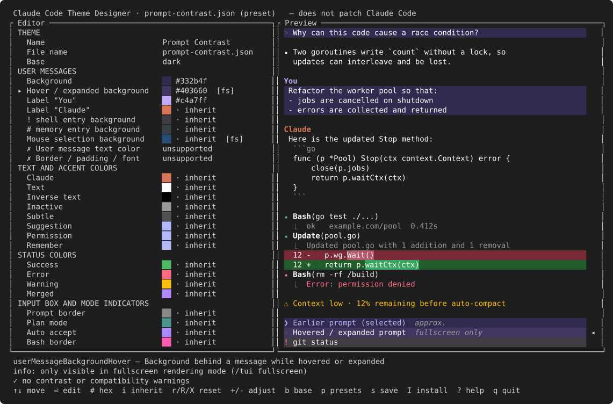
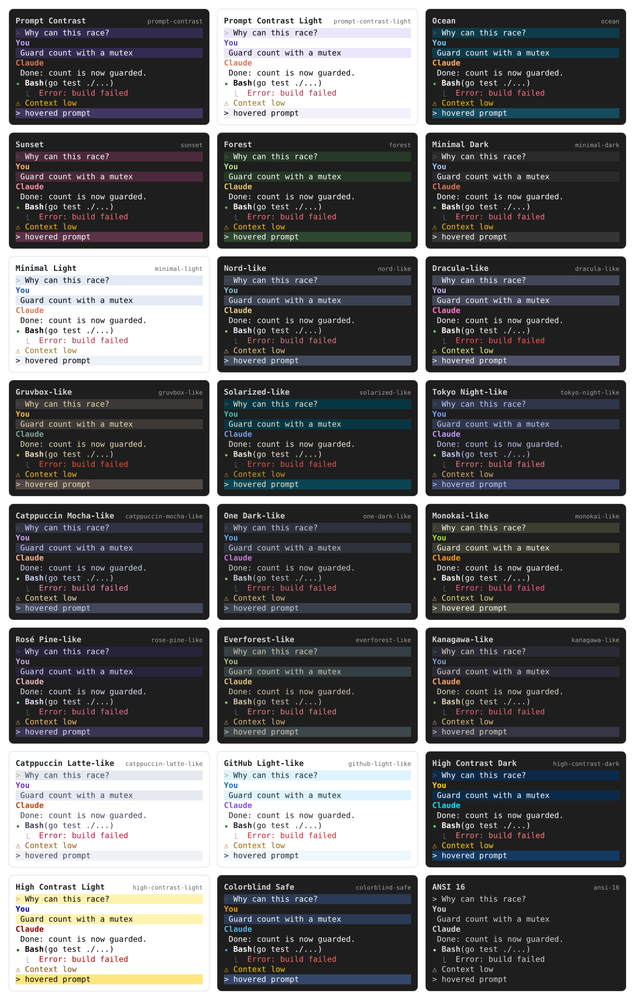

<div align="center">

# Claude Code Theme Designer

**Design, preview and install custom themes for [Claude Code](https://code.claude.com), right in your terminal.**

[](https://github.com/aleslanger/claude-code-theme-designer/actions/workflows/ci.yml)
[](go.mod)
[](LICENSE)



</div>

> [!IMPORTANT]
> **This tool does not patch Claude Code.** It writes plain theme files to
> `~/.claude/themes/` through Claude Code's
> [official custom theme support](https://code.claude.com/docs/en/terminal-config#create-a-custom-theme)
> and changes nothing else.

In long sessions your own prompts get lost among Claude's replies.
`claude-theme` lets you give your messages a distinct background and label
color, see the result immediately in a simulated transcript, and install the
theme safely.

## Contents

- [Features](#features)
- [Installation](#installation)
- [Quick start](#quick-start)
- [Usage](#usage)
- [What you can and cannot style](#what-you-can-and-cannot-style)
- [Presets](#presets)
- [Files and locations](#files-and-locations)
- [Security](#security)
- [Compatibility](#compatibility)
- [Troubleshooting](#troubleshooting)
- [Development](#development)
- [Contributing](#contributing)
- [License](#license)

## Features

- **Live preview.** A simulated Claude Code transcript updates on every
  keypress: prompts, replies, code, tool calls, diffs, warnings, errors,
  selected and hovered messages, `!` and `#` entries, and the input box.
  Everything stays in memory and nothing is written until you save.
- **Only real tokens.** The editor offers the 62 tokens documented by
  Anthropic, each tracked to its documentation source. Anything the theme API
  cannot do is shown as *unsupported* instead of being faked.
- **Color editing:**
  - xterm-256 palette picker with live preview,
  - any documented color syntax (`#rrggbb`, `#rgb`, `rgb(r,g,b)`, `ansi256(n)`, `ansi:<name>`),
  - lighten and darken,
  - inherit from the base,
  - reset a token, a section or the whole theme.
- **23 presets.** Originals, palettes inspired by popular schemes, and
  accessibility variants (high contrast, colorblind-safe, 16-color).
- **Accessibility.** WCAG contrast checks for prompt text, labels and status
  colors. Low contrast produces a warning. Only practically unreadable text
  blocks an install, and you can override that too.
- **Safe by design:**
  - atomic writes and no overwrite without confirmation,
  - automatic backups,
  - strict validation of imported files,
  - no theme value ever reaches your terminal unescaped.
- **Scriptable.** Every action is also a CLI command, with meaningful exit codes.
- **Zero dependencies at runtime.** A single static binary: no daemon, no
  network access, no Node.js.

## Installation

### Install script (Linux, macOS)

```sh
curl -fsSL https://raw.githubusercontent.com/aleslanger/claude-code-theme-designer/master/install.sh | sh
```

The script downloads the latest release for your OS and CPU, **verifies its
SHA-256 checksum**, and installs `claude-theme` to `~/.local/bin`. Options:

| Option | Effect |
|---|---|
| `--version v0.2.0` | install a specific release |
| `--bin-dir DIR` | install somewhere else |
| `--uninstall` | remove the binary |
| `--uninstall --purge` | also remove drafts, backups and settings (`~/.config/claude-theme-designer`) |
| `--yes` | skip confirmation prompts |

To pass options through a pipe: `curl -fsSL …/install.sh | sh -s -- --version v0.2.0`.

### With Go

```sh
go install github.com/aleslanger/claude-code-theme-designer/cmd/claude-theme@latest
```

### From source

```sh
git clone https://github.com/aleslanger/claude-code-theme-designer
cd claude-code-theme-designer
make install          # installs to ~/.local/bin (PREFIX=/usr/local to change)
```

### Updating

| Installed with | Update by |
|---|---|
| install script | running the same command again (it replaces the binary atomically) |
| `go install` | running `go install …@latest` again |
| source | `git pull && make install` |

Check your version with `claude-theme version`.

### Uninstalling

1. Remove the themes you installed (only the ones `claude-theme` created are touched):

   ```sh
   claude-theme list                   # shows which themes are managed
   claude-theme uninstall <name> --yes
   ```

2. Remove the tool:

   ```sh
   curl -fsSL https://raw.githubusercontent.com/aleslanger/claude-code-theme-designer/master/install.sh | sh -s -- --uninstall --purge
   # or: make uninstall    /    rm "$(command -v claude-theme)"
   ```

Windows: download the `windows` archive from
[Releases](https://github.com/aleslanger/claude-code-theme-designer/releases) or use `go install`.

## Quick start

```sh
claude-theme                           # open the editor, starting from "Prompt Contrast"
```

Change colors, press `I` to install, then select the theme in Claude Code:

```text
/theme
```

Or install a preset without opening the editor:

```sh
claude-theme install prompt-contrast
```

> [!NOTE]
> If `~/.claude/themes/` did not exist when Claude Code started, restart Claude
> Code once after the first install. After that, theme changes apply without a restart.

## Usage

### Editor

| Key | Action |
|---|---|
| `↑` `↓` / `j` `k` | move (`PgUp` `PgDn`, `g` `G` to jump) |
| `Enter` | edit color in the palette · cycle base · rename |
| `#` | type a color value |
| `i` | inherit (remove the override) |
| `r` / `R` / `X` | reset token / section / whole theme |
| `+` / `-` | lighten / darken |
| `b` | cycle base preset (dark, light, daltonized, ansi) |
| `p` | load a starter preset |
| `s` | save draft |
| `I` | install into Claude Code |
| `?` · `q` | help · quit (asks if there are unsaved changes) |

In the palette, moving the cursor applies the color live, `Enter` keeps it and
`Esc` restores the original. Rows marked `[fs]` only take effect in Claude
Code's fullscreen mode.

### Commands

```text
claude-theme [--color auto|truecolor|256|16|none] <command>
```

| Command | Description |
|---|---|
| `edit [name]` | open the editor (the default command). Without a terminal it prints a preview instead |
| `preview [name] [--width N]` | print the preview |
| `list` | presets, drafts and installed themes, with managed / edited / symlink flags |
| `show <name>` | print the JSON that `install` would write |
| `install [name] [--force] [--allow-errors] [--as slug]` | install into Claude Code. `--force` replaces an existing file (backup kept). `--allow-errors` accepts unreadable contrast |
| `uninstall <name> [--yes] [--force]` | remove a theme **installed by claude-theme**. `--force` also removes one edited since installing |
| `import <file> [--as slug] [--force]` | strictly validate a file and store it as a draft |
| `export <name> [-o file] [--force]` | print or save a theme |
| `validate <file> [--strict]` | exit code 1 on errors, or on warnings with `--strict` |
| `config terminal-background <color\|unset>` | tell the contrast checks your terminal's background |
| `doctor` | diagnose your setup |

Names are resolved in this order: your **drafts**, then **presets**, then
themes already **installed** in Claude Code.

## What you can and cannot style

Claude Code themes control colors only. The tool knows which colors are
officially themable:

| Goal | Token | Status |
|---|---|---|
| Background of your prompts | `userMessageBackground` | ✅ documented |
| Background of a hovered/expanded prompt | `userMessageBackgroundHover` | ✅ documented, **fullscreen mode only** |
| Color of the `You` label | `briefLabelYou` | ✅ documented |
| Color of the `Claude` label | `briefLabelClaude` | ✅ documented |
| `!` shell and `#` memory entry backgrounds | `bashMessageBackgroundColor`, `memoryBackgroundColor` | ✅ documented |
| Text color of your prompts only | — | ❌ not available (only the global `text` token exists) |
| Borders, padding, fonts | — | ❌ not available |

The editor groups all other documented tokens (text and accents, status
colors, input box, diffs, usage meter, shimmer, subagent and rainbow colors)
by their documentation category.

## Presets

23 starter themes, each passing WCAG AA contrast for prompt text, labels and
status colors (enforced by tests). Load one with `p` in the editor, or
directly: `claude-theme install tokyo-night-like`.



| Category | Presets |
|---|---|
| **Original** | `prompt-contrast` (default), `prompt-contrast-light`, `ocean`, `sunset`, `forest`, `minimal-dark`, `minimal-light` |
| **Inspired by popular palettes** | `nord-like`, `dracula-like`, `gruvbox-like`, `solarized-like`, `tokyo-night-like`, `catppuccin-mocha-like`, `catppuccin-latte-like`, `one-dark-like`, `monokai-like`, `rose-pine-like`, `everforest-like`, `kanagawa-like`, `github-light-like` |
| **Accessibility** | `high-contrast-dark`, `high-contrast-light`, `colorblind-safe` (Okabe-Ito labels on the daltonized base), `ansi-16` (16 terminal colors, follows your terminal palette) |

The "-like" presets approximate public palettes, adjusted where needed to pass
the contrast checks. They are not the official schemes and not official Claude
Code themes. `claude-theme list` shows every preset with a short description.

## Files and locations

| Path | Contents |
|---|---|
| `~/.claude/themes/<name>.json` | installed themes, read by Claude Code (`$CLAUDE_CONFIG_DIR/themes` when set) |
| `~/.config/claude-theme-designer/config.json` | designer settings and fingerprints of themes it installed |
| `~/.config/claude-theme-designer/themes/` | your drafts |
| `~/.config/claude-theme-designer/backups/` | backups taken before every overwrite or removal |

The designer's state never goes into theme files, and backups are kept out of
`~/.claude/themes/` because Claude Code would load them as themes. A theme file
contains exactly what Claude Code reads:

```json
{
  "name": "Prompt Contrast",
  "base": "dark",
  "overrides": {
    "briefLabelYou": "#c4a7ff",
    "userMessageBackground": "#332b4f",
    "userMessageBackgroundHover": "#403660"
  }
}
```

## Security

The full threat model is in [docs/THREAT_MODEL.md](docs/THREAT_MODEL.md).

- **Themes are data, never code.** Imports accept only `name`, `base` and
  string color `overrides`. Hooks, commands, unknown top-level keys, nested
  values, duplicate keys, invalid UTF-8, BOMs and files over 256 KB are rejected.
- **No path tricks.** Theme names must match `[A-Za-z0-9_-]{1,64}`, and every
  path is proven to stay inside its directory.
- **No partial or surprise writes:**
  - every write goes to a temp file, then `fsync`, then an atomic rename;
  - nothing is overwritten without confirmation or `--force`, and the previous
    content is backed up first;
  - symlinked destination files are refused, reads never block on FIFOs, and
    `uninstall` re-checks the file right before deleting it.
- **No terminal injection.** Colors are re-encoded numerically, and all
  displayed text is stripped of control characters, escape sequences, bidi and
  zero-width characters.
- **Minimal footprint.** The only subprocess is `claude --version`, run by
  `doctor` without a shell and with a timeout. There is no network access at
  runtime. The install script verifies release checksums.

Please report vulnerabilities privately; see [SECURITY.md](SECURITY.md).

## Compatibility

- **Claude Code.** Custom themes as documented on
  [terminal-config](https://code.claude.com/docs/en/terminal-config#create-a-custom-theme).
  The token registry was verified against **Claude Code 2.1.287**, and
  `claude-theme doctor` warns when your version differs.
- **Forward compatible.** Tokens the tool does not know, for example from a
  newer Claude Code, are **kept** in themes and reported, never dropped.
  Claude Code itself ignores unknown tokens.
- **Terminals.** Truecolor, 256-color and 16-color terminals are supported.
  Without truecolor, both the preview and Claude Code show the nearest palette
  color. `NO_COLOR` and `TERM=dumb` are respected, and without a usable
  terminal the editor falls back to a plain preview.
- **Platforms.** Linux, macOS and Windows (amd64, arm64).

Base-preset defaults (used to preview tokens you do not override) are not
published by Anthropic. They were captured from Claude Code 2.1.287, so the
preview of inherited colors is a close approximation.

## Troubleshooting

| Symptom | Solution |
|---|---|
| Theme missing in `/theme` | Restart Claude Code once if `~/.claude/themes/` was just created. Run `claude-theme doctor`. |
| Hover color has no effect | `userMessageBackgroundHover` applies only in fullscreen mode (`/tui fullscreen`). |
| Colors differ from the preview | On terminals without truecolor, colors are approximated. `ansi:<name>` colors follow your terminal's palette. |
| "fullscreen editor unavailable" | stdin/stdout is not a terminal, or `TERM=dumb`. Use `preview`, `install` and the other commands. |
| "already exists" on install | Confirm interactively, or pass `--force`. A backup is kept. |
| "not installed by claude-theme" | `uninstall` only removes themes this tool created. Delete other files yourself. |
| Contrast warnings mention an assumed background | `claude-theme config terminal-background '#1e1e1e'` |
| "designer config is corrupt" | Defaults are used. The broken file is preserved as `config.json.corrupt-<time>`. |

## Development

```sh
make test     # go test -race ./...
make cover    # coverage summary
make lint     # gofmt + go vet
make build    # ./claude-theme
```

The architecture keeps all business logic independent of the terminal UI:

```text
internal/theme      domain model: colors, names, contrast       (pure, no I/O)
internal/registry   token registry + base palettes               (generated, embedded)
internal/validate   provenance, version and contrast checks
internal/serialize  strict decoding / deterministic encoding     (trust boundary)
internal/store      paths, atomic writes, config, drafts, install
internal/render     preview frame + ANSI encoder                 (shared by preview and checks)
internal/app        use cases shared by CLI and TUI
internal/tui        Bubble Tea editor                            (UI state only)
internal/cli        commands                                     (all I/O injected, tested without a terminal)
internal/doctor     diagnostics
tools/genregistry   regenerates the registry from the official docs
tools/screenshot    regenerates docs/screenshot.svg and docs/presets.svg (-gallery)
```

Snapshot tests guard the preview and the editor layout. After an intended
visual change, refresh them with
`go test ./internal/render ./internal/tui -update` and review the diff.

**Updating the token registry** after a Claude Code docs change:

```sh
curl -sL https://code.claude.com/docs/en/terminal-config.md -o /tmp/terminal-config.md
go run ./tools/genregistry -docs /tmp/terminal-config.md
git diff internal/registry/data/tokens.json    # review every change
```

**Releasing:** push a tag `vX.Y.Z`. CI runs the tests, builds the archives
with `scripts/dist.sh` and publishes them with `checksums.txt`, which the
install script verifies.

## Contributing

Contributions are welcome. See [CONTRIBUTING.md](CONTRIBUTING.md). The ground rules:

1. no patching of Claude Code in any form,
2. no undocumented tokens in the editor,
3. a test for every behavior change.

## License

[MIT](LICENSE).

Not affiliated with or endorsed by Anthropic. "Claude" and "Claude Code" are
trademarks of Anthropic.
